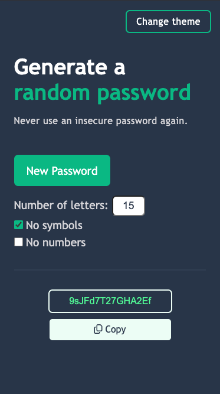
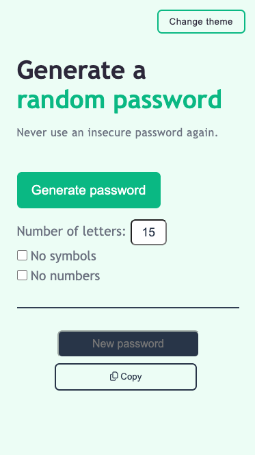

# 🔐 Password Generator

A simple, responsive password generator web app and Progressive Web App (PWA).

Users can:

- Choose the password length
- Decide whether to include symbols or numbers
- Copy the generated password with one click
- Switch between themes
- Installable as a Progressive Web App (PWA) for offline use

👉 **Live Demo:** [Password Generator](https://drasko-password-generator.firebaseapp.com/)

---

## 🚀 Built With

- **HTML5**
- **CSS3**
- **JavaScript (ES6)**
- **Git**

---

## 📚 What I Learned

While building this project, I practiced:

- DOM manipulation with `.addEventListener()`, `.querySelector()`, and `.getElementById()`
- Using array methods like `concat()` for building character pools
- Implementing randomization with `Math.random()` and `Math.floor()`
- Copying text to the clipboard with the Clipboard API
- Applying control flow (`if`, `else if`, `&&`, `for` loops) in practical use
- Toggling themes dynamically for light/dark mode
- Deploying a static site using Firebase Hosting
- Adding accessible labels and improving screen reader support

---

## 📸 Screenshot

  
  

